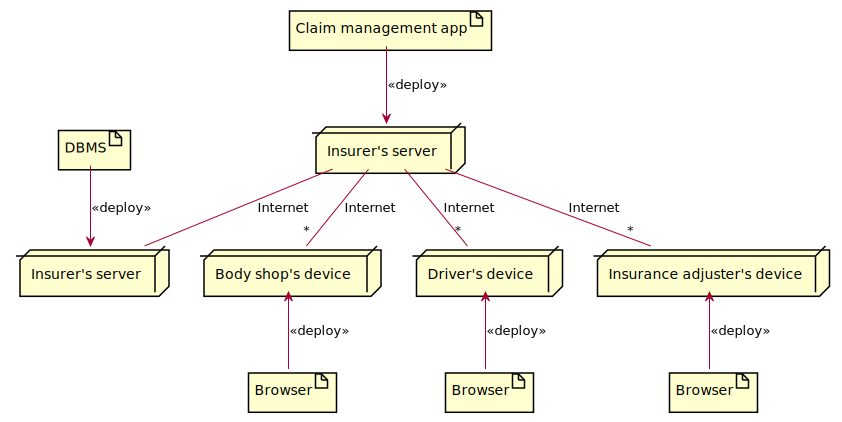

# Table of contents

- [Abstract](#abstract)
- [Models](#models)
	- [Organizational model](#organizational-model)
	- [Data model](#data-model)
	- [Process model](#process-model)
	- [Technological model](#technological-model)
	- [Business rules](#business-rules)
- [Strategy and management](#strategy-and-management)
	- [CSFs](#csfs)
	- [KPIs](#kpis)
- [Process redesign](#process-redesign)
	- [Performance](#performance)
	- [Software functions](#software-functions)
	- [Stakeholders](#stakeholders)

# Abstract

Accidents happen and cars are damaged. Car insurance may cover this damage. Let’s assume that D1 (Driver1, V1 = vehicle1), insured with I1, had an accident with Driver2 (insured with I2, and driving V2). D1 is responsible for the accident, so I1 will pay the repair of V2. 

In the following we consider the damage claim process. So assume that all the process for notifying the accident to companies I1 and I2 has been made, the agreement on who was responsible for the accident was completed too, the handling of the damage claim can start by opening a claim request. In the damage claim process the delicate point in the repair is the estimation of the cost for the repair. This evaluation is made by an insurance adjuster (perito assicurativo). An insurance adjuster is a professional, by law must not be an employee of any insurance company, can do this job only after passing an exam, and must be part of the national insurance adjuster register (albo professionale). The value of the repair cannot exceed the commercial value of the car. 

## AS IS process

The claim process (reimburse D2 for damages on V2) is handled by I2 . (Remark that, by law, I2 and not I1 manages the claim). 

I2 opens a claim request, in the name of D2, for V2. Company I2 selects an insurance adjuster IA and sends to IA the claim request by email. IA contacts D2, agrees on an appointment to evaluate the damage. After the appointment IA sends, by email, a report with a description of the damage, an estimate of the amount, pictures of the damage on V2. 

I2 analyzes the report, if accepted sends to D2 (by paper letter) the damage reimbursement proposed. D2 can agree or not with it, if he agrees he brings V2 to a body shop (carrozzeria), V2 is repaired, D2 pays and sends the invoice to I2, I2 reimburses D2, pays a fee to IA, I2 closes the claim process.

## TO BE process

I2 selects a number of body shops around the nation (agreed body shops). The start of the claim process does not change. I2 opens a claim request, in the name of D2, for V2. D2 has a personal account on the information system of I2, on this account can see her claim request, the list of agreed body shops, and instructions on how to proceed. D2 selects a body shop BS from the list and drives D2 there. BS takes charge of D2, accesses the claim request about V2 on the information system of I2. BS evaluates the damage and estimates the value for the repair. All this info, and pictures of the damage, is attached to the claim request. I2 evaluates all and: either agrees, or not. In case of no agreement sends an insurance adjuster IA to evaluate the damage. Also IA accesses all info on the information system of I2, and uploads another estimate for the damage. Finally I2 and BS agree on the amount. BS makes the repair. 

When ready BS notifies D2 who can retire the vehicle. I2 pays BS, possibly pays a fee to IA, closes the claim process.

# Models

In the following model the TO BE situation.

## Organizational model

- Insurer (Organization)
- Body shop (Organization)
- Driver (Role)
- Insurance adjuster (Role)

## Data model

## Process model

| Name | Input | Output | Description | Organizational units / roles involved |
| ---- | ----- | ------ | ----------- | ------------------------------------- |
| Claim management | Damage | Repair | Open claim, wait for body shop selected, update claim (selected body shop), notify body shop, notify driver, wait for estimation accepted, wait for repair, close claim | Insurer, driver, body shop |
| Estimation assessment | Estimation received | Estimation accepted/refused | Receive Retrieve claim, check estimation, assess estimation, update claim (attach estimate, update state), possibly notify insurance adjuster (if not accepted), notify body shop | Insurer, body shop, insurance adjuster |

## Technological model

## Business rules

| ID | Natural language |
| -- | ---------------- |
| | |

# Strategy and management

## CSFs

| ID | Description |
| -- | ----------- |
| | |

## KPIs

| CSF | ID | Category | Description | Unit of measure |
| --- | -------- | ---- | ----------- | --------------- |
| | | | | |

# Process redesign

## Performance

| KPI | AS IS | TO BE |
| --- | ----- | ----- |
| | | |

## Software functions

| Process / activity | Software functions |
| ------------------ | ------------------ |
| | |

## Stakeholders

| Stakeholder | PROs | CONs |
| ----------- | ---- | ---- |
| | | |