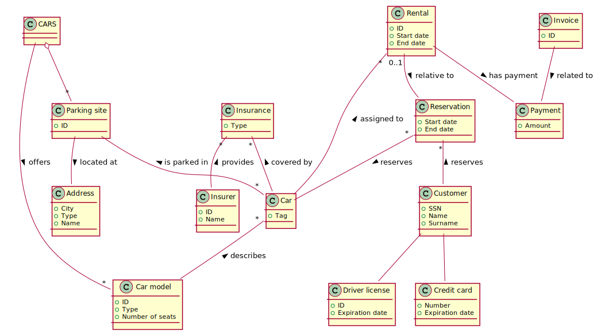
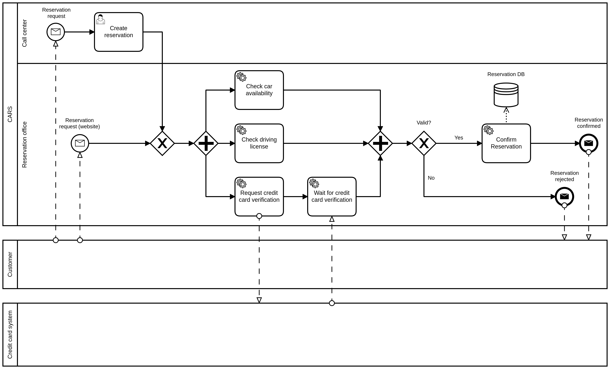
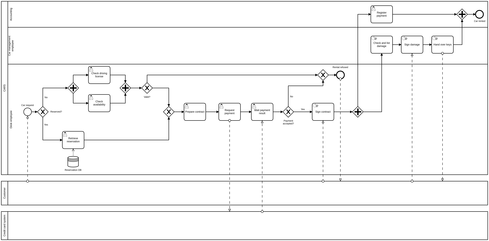
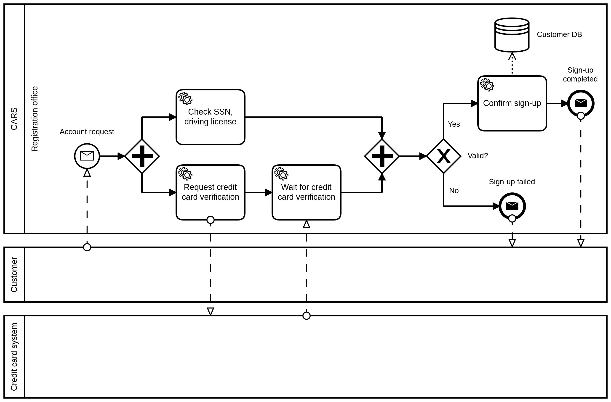
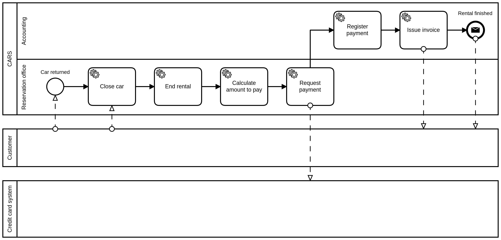
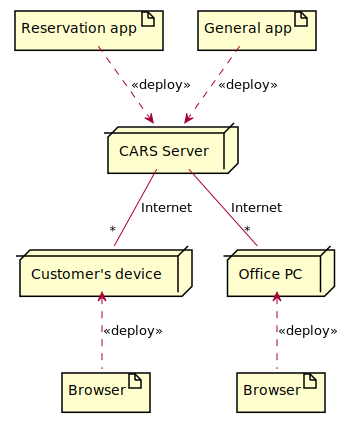
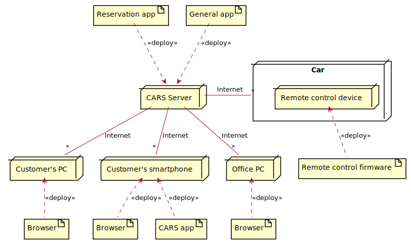
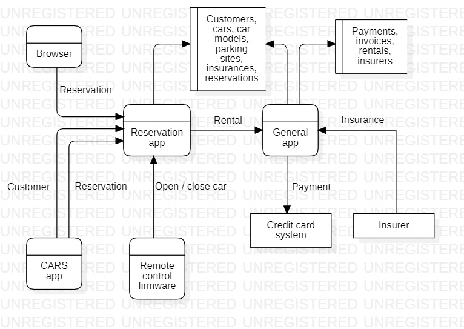

# Table of contents

- [Abstract](#abstract)
- [Data model](#data-model)
- [Organizational model](#organizational-model)
- [Process model](#process-model)
- [Business rules](#business-rules)
- [Technological model](#technological-model)
- [Strategy and management](#strategy-and-management)

# Abstract

Car rental companies own a number of cars and a number of sites where cars are parked when not in use. Customers rent cars for a period of time (having made a reservation, or not) and return them. 
We focus on the CARS company.

## AS IS process

A customer may reserve a car, using the company web site, or the call center (this step is optional). 
A customer steps into the office close to the rental car parking site and completes the first step of the check out. The contract for the rental is defined (period of rental, name of driver, related ID document and driving license, insurances, damage deposit, partial and total fees, credit card), signed by both parties, and the payment for the rental is completed (payment has two parts, rental and damage deposit – the latter is normally returned at the end of the rental).  Further, a specific car (identified by its tag) is assigned to the rental. 
Then the customer walks to the car parking site. Here the second part of the check out happens. 
An employee checks with the customer the car and lists all visible damages on the car in an annex to the contract. Also this annex is signed by both parties. Then the employee hands the car to the customer (this of course includes the keys) and the rental starts.
The final step is check in. The customer drives the car to parking site. An employee receives the car and the keys, checks with the customer for new damages. If there are damages another process starts (we leave this process out of this analysis). At this point the rental ends. The company issues an invoice and possibly returns the damage deposit to the customer.

## TO BE process

The idea is to improve the process by introducing the same innovations used by car sharing companies. 
A customer has first to define an account with CARS. In this step the customer uploads his documents (ID, driving license) and a credit card. If all is right CARS approves and the customer can later rent cars. This step can be performed on a PC or smart phone. In any case the customer has to install the CARS app on her smartphone. 
When a registered customer wants to rent a car she has to do a reservation (via app or PC). 
Check out works as follows. The customer walks directly to the rental car parking, via the app she signals that she wants to start the rental. The app answers with position and tag of the assigned car. 
When the customer is close to the car she asks, via the app, to open the car. The system opens the car (the car needs to be modified via a device connected to the cellular network and capable of controlling some car functions, like door open/close).  The keys are inside the car. The customer starts the car, and the rental. 
The check in is similar. The customer parks the car in the rental car parking, stops the car, exits, and asks the app to close the car. At this point the rental is over. 
Invoicing and payments proceed through the credit card. 
Damage deposits and possibly damage reimboursements are avoided, introducing by default an insurance to cover all.

## Technology

Assume one or more PCs per parking site office, one central server, one application for reservations, another for all the rest.

# Data model

## AS IS

## TO BE

# Organizational model

## AS IS

- CARS (Organization)
  - Reservation office (Organizational Unit)
  - Call center (Organizational Unit)
  - Parking site office (Organizational Unit)
    - Desk employee (Role)
    - Car management employee (Role)
  - Accounting (Organization Unit)
  - Puchase office (Organizational Unit)
  - IT area (Organizational Unit)
- Customer (Role)
- Credit card system (Organization)

## TO BE

- CARS (Organization)
  - Registration office (Organizational Unit)
  - Reservation office (Organizational Unit)
  - Accounting (Organization Unit)
  - Puchase office (Organizational Unit)
  - IT area (Organizational Unit)
- Customer (Role)
- Credit card system (Organization)

# Process model

## AS IS

### Table

| Name | Input | Output | Roles involved | Description |
| ---- | ----- | ------ | -------------- | ----------- |
| Reservation | Reservation request | Reservation | Customer, reservation office, call center |  Check credit card, driving license and car availability, reserve car. |
| Check-out | Car request | Car rented | Customer, desk employee, accounting, car management employee | Check credit card, driving license and car availability (if not reserved), pay (including a damage deposit), sign contract, check and sign existing damage of the car, hand over keys. |
| Check-in | Car returned | rental finished | Customer, car management employee, desk employee | Check new damage, possibly return damage deposit, issue invoice. |

### BPMN

#### Reservation

#### Check-out

#### Check-in

## TO BE

### Table

| Name | Input | Output | Roles involved | Description |
| ---- | ----- | ------ | -------------- | ----------- |
| Sign-up | Account request | Account | Customer, reservation office |  Check ID card, driving license and credit card, create account. |
| Reservation | Reservation request | Reservation | Customer, reservation office |  Check car availability, reserve car. |
| Check-out | Car request | Car rented | Customer, reservation office | Start rental, show position and tag of car, open car. |
| Check-in | Car returned | Rental finished | Customer, reservation office | Close car, end rental, calculate amount to pay, pay, issue invoice. |

### BPMN

#### Sign-up

#### Reservation

#### Check-out

#### Check-in

# Business rules

## Natural language

| ID | Description |
| -- | ----------- |
| BR1 | Only customers with a valid driving license can rent a car. |
| BR2 | Only cars with at least one active insurance can be rented. |

## Drools Rule Language

### BR1

#### AS IS

$c: Customer( $d : drivingLicense)  
Contract( customer == $c, endDate > $d.expirationDate )

#### TO BE

$c: Customer( $d : drivingLicense)  
Reservation( customer == $c, endDate > $d.expirationDate )

### BR2

$c : Car()  
exists Insurance( car == $c )

## TO BE

# Technological model

## AS IS

### Deployment diagram

### Data flow diagram

### Software functions

TODO

## TO BE

### Deployment diagram

### Data flow diagram

### Software functions

TODO

# Strategy and management

Remark: in the following we consider only the *TO BE* situation.

## Business Model Canvas

<table>
  <tr>
    <td rowspan="2">
      <b>Key Partners</b>
      

        Car producer 
        Car maintainer 
        Insurer 
        Car firmware producer
      

    </td>
    <td>
      <b>Key Activities</b>
      

        Car rental (reservation, check-out, check-in) 
        Advertising 
        Car purchase 
        Car management (relocation planning)
      

    </td>
    <td rowspan="2" colspan="2">
      <b>Value Propositions</b>
      

        Easy to use, low cost car rental in city centers 
      

    </td>
    <td>
      <b>Customer Relationships</b>
      

        Personal assistance (call center) 
        Self-service (website, app)
      

    </td>
    <td rowspan="2">
      <b>Customer Segments</b>
      

        Mass market
      

    </td>
  </tr>
  <tr>
    <td>
      <b>Key Resources</b>
      

        Cars 
        Parking sites
      

    </td>
    <td>
      <b>Channels</b>
      

        CARS.com 
        CARS app
      

    </td>
  </tr>
  <tr>
    <td colspan="3">
      <b>Cost Structure</b>
      

        Purchase of cars 
        Maintenance of cars 
        Insurance of cars 
        Rent/purchase of parking sites 
        Advertising
      

    </td>
    <td colspan="3">
      <b>Revenue Streams</b>
      

        Car rental
      

    </td>
  </tr>
</table>

## Critical Success Factors (CSFs)

### Indicators

| CSF | Type | Description |
| -- | ---- | ----------- |
| C1 | Competitive | Usability of service. |
| C2 | Competitive | Low price of rental. |
| C3 | Business domain | Availability of cars. |

### Measures

| CSF | Measure | Description |
| --- | ------- | ----------- |
| C1 | M11 | Response time in reservation. |
| C1 | M12 | Response time in check-out. |
| C1 | M13 | Response time in check-in. |
| C1 | M14 | Time to sign-up. |
| C2 | M21 | Cost per car (purchase, maintenance, insurance). |
| C3 | M31 | Percentage of satisfied reservations. |

### CSF vs organization

| CSF | Registration office | Reservation office | Accounting | Purchase office | IT area |
| --- | ------------------- | ------------------ | ---------- | --------------- | ------- |
| C1 | M14 | M11-M13 | M11 | - | M11-M14 |
| C2 | - | - | - | M21 | - |
| C3 | - | M31 | - | - | - |

## Key Process Indicators (KPIs)

### Reservation

| Type | Description | Unit of measure |
| ---- | ----------- | --------------- |
| General | Input volume | # reservation requests |
| General | Output volume | # reservations |
| General | Inventory | # cars |
| Efficiency | Cost per unit | cost of IT for website/app / # reservation requests |
| Service | Response time | time reservation completed - time reservation requested |
| Quality | Reliability | # lost reservations |
| Quality | Satisfaction | average rate of customers (for reservation, via website/app) |

### Check-out

TODO

### Check-in

TODO
