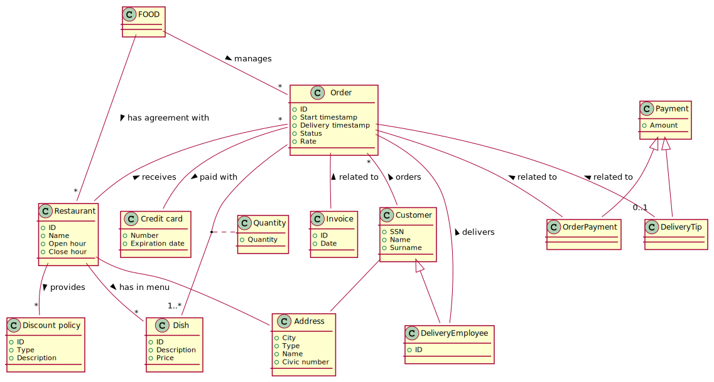
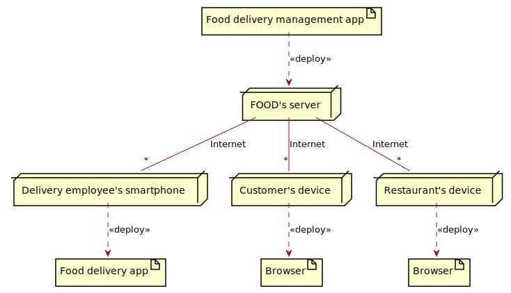

# Table of contents

- [Abstract](#abstract)
- [Models](#models)
	- [Organizational model](#organizational-model)
	- [Data model](#data-model)
	- [Process model](#process-model)
	- [Technological model](#technological-model)
	- [Business rules](#business-rules)
- [Strategy and management](#strategy-and-management)
	- [CSFs](#csfs)
	- [KPIs](#kpis)
- [Process redesign](#process-redesign)
	- [Performance](#performance)
	- [Software functions](#software-functions)
	- [Stakeholders](#stakeholders)

# Abstract

Many restaurants offer a food delivery service. The customer selects a number of dishes from a menu, then calls the restaurant and orders the dishes. The restaurant prepares the dishes, packs them and delivers to the customer. Since a few years third party companies provide the selection and delivery service.

## AS IS process

A restaurant R advertises its offer of dishes and prices (either by setting up an informational web site, or by diffusing leaflets in its area). The restaurant manager receives orders by phone. Each order is sent to the kitchen where it is prepared and packaged. Then another employee of the restaurant takes the package and delivers it, using a vehicle (bike, car or else) owned by the restaurant. The employee, upon delivery, receives the payment by the customer and returns to the restaurant.

## TO BE process

Company FOOD sets up the infrastructure: a web site and employees for delivery. A restaurant R defines a general agreement with FOOD. Usually FOOD collects a fixed fee for the delivery, and retains a 10-15% share of the restaurant bill. When the agreement is defined R uploads on FOOD’s web site its offer (dishes and prices, operating hours, discount policies).

A customer accesses FOOD’s web site, where she selects one of the restaurants (say R), selects dishes, gives her address, pays via credit card. The manager of restaurant R collects the order from FOOD’s web site, passes the order to the kitchen that prepares and packages. An employee from FOOD collects the package and delivers to the customer.

The delivery employee uses an app to interact with FOOD. The customer, via the FOOD web site, can rate the service and add a tip for the delivery employee.

# Models

In the following model the TO BE situation.

## Organizational model

## Data model

## Process model

| Name | Input | Output | Description | Organizational units / roles involved |
| ---- | ----- | ------ | ----------- | ------------------------------------- |
| New restaurant | Agreement request | Restaurant registered | Define and negotiate agreement, add restaurant (info, menu, discount policies). | FOOD, restaurant |
| Restaurant management | Change request | Change done | Search restaurant, update restaurant (menu / discount policy) |
| Food order | Want to buy food | Food order | Select restaurant, select dishes, provide address, provide credit card, check credit card, pay, create order, notify restaurant. | Customer, FOOD |
| Food delivery | Food order | Food order closed | Collect package in restaurant, deliver package to customer, close order. | Delivery employee |
| Rate and tip | Food delivered | Rate/tip added | Select order, add rate and/or tip. | Customer |

## Technological model

## Business rules

| ID | Natural language |
| -- | ---------------- |
| BR1 | Distance from restaurant's address to customer's address must be less than 5 km. |

# Strategy and management

## CSFs

| ID | Description |
| -- | ----------- |
| CSF1 | Increase customer satisfaction |
| CSF2 | reduce the cost of the process for the restaurant R and company FOOD |

## KPIs

| CSF | ID | Category | Description | Unit of measure |
| --- | -------- | ---- | ----------- | --------------- |
| - | NO | General | Number of orders | - |
| - | NDO | General | Number of delivered ordered | - |
| CSF1 | CS | Quality | Rate given to order | Stars (1 to 5) |
| CSF1 | LT | Service | Time from order to delivery | Time |
| CSF1 | PWO | Quality | Percentage of wrong orders (with mistakes in delivered food) | - |
| CSF2 | UC_order | Efficiency | Total cost of order / NDO   Total cost includes: employees' salary, cost of website, cost of vehicle (buy, maintain, fuel) | Euro |
| CSF2 | UC_restaurant | Efficiency | Total cost of order / NDO   Total cost includes: marketing, time of employees for cooking (kitchen), time of employees for managing orders | Euro |

# Process redesign

## Performance

| ID | AS IS | TO BE |
| --- | ----- | ----- |
| NO, NDO | | No changes. |
| CS, PWO | | Increases, less mistakes thanks to the selection via website and faster communication. |
| LT | | May slightly increase, faster communication. |
| UC_order | Not available, FOOD is introduced in TO BE | |
| UC_restaurant | | Reduces, cost of managing and delivering orders is outsourced (no vehicles, no delivery employees) |

## Software functions

| Process / activity | Software functions |
| ------------------ | ------------------ |
| New restaurant | Create restaurant, create dish, create discount policy. |
| Restaurant management | CRUD restaurant, CRUD dish, CRUD discount policy. |
| Food order | Show list of restaurants, select restaurant, show list of dishes, select dishes, CRUD order, pay with credit card, send notification to restaurant. |
| Food delivery | Search order, close order. |
| Rate and tip | Search order, add rate, pay tip. |

## Stakeholders

| Stakeholder | PROs | CONs |
| ----------- | ---- | ---- |
| FOOD | New business | - |
| Restaurant | Outsourcing non-key activities, focus on food preparation | Share income |
| Customer | Larger choice of restaurants on one platform, satisfaction improved | - |