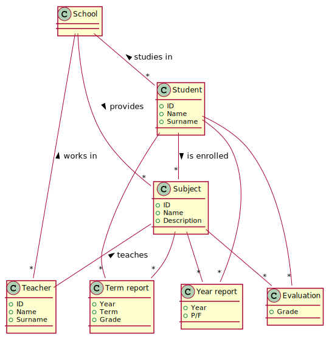

# Management of grades in secondary school

## Description

In a secondary school each student (14-18 years old) follows a certain number of subjects. Each subject is taught by a certain teacher. During the academic year the teacher assigns to each student a certain number of grades for the subject, as an evaluation of oral interrogations, written tests or projects.
The academic year is divided in two terms. At the end of each term each teacher decides a summary grade for the subject. The grade is not a mathematical average of grades taken during the term. An evaluation report is produced for each student and subject.
At the end of the academic year (june) another evaluation report is prepared. This final one is issued by a committee made by all teachers, and contains, beyond a summary grade for each subject and student, a global pass/fail result for the student.

### AS IS process
Grades are written on a paper book. Evaluation reports (at end of term, at end of year) are also on paper. Until the student is less than 18 years old parent have to sign it on paper and return to the teacher. When the student is 18 she can sign the reports.

### TO BE process
Propose a new paperless process. Assume that all parents (and students at 18 years old) have a SPID identity.

## Lab 1 - Data model

