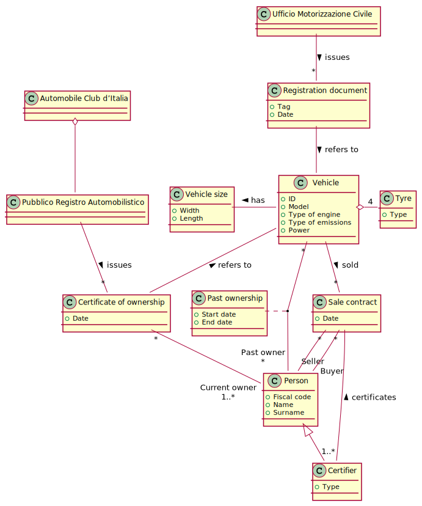

# Vehicle transfer of ownership

## Description

In all countries a state agency keeps track of all vehicles, their characteristics and their owners.

In Italy the Ufficio per la Motorizzazione Civile (a branch of the Ministry of Transport) manages the technical side of vehicles. It is the entity that decides if a vehicle can circulate, in the positive case issues a tag for the vehicle, and a corresponding ‘vehicle registration document’ (‘carta di circolazione’) that contains the technical description of the vehicle (type of engine, emissions, power, vehicle dimensions, tyres, etc)

For historical reasons another entity, Automobile Club d’Italia (ACI), keeps track of ownership of vehicles. The PRA (Pubblico Registro Automobilistico), managed by ACI, contains the list of all vehicles that can circulate (i.e. that have a ‘vehicle registration’) and for each vehicle all owners (current and past owners). The PRA issues another document, the ‘certificate of ownership’ (‘certificato di proprietà’) that states who is (are) the current owner(s) of a vehicle.

We focus on the transfer of ownership process.

### AS IS process
A certain vehicle V is owned by O, who wants to sell it to  B. O and B sign a sale contract, on paper and with a defined template. The sale contract is certified by an authority (a notary, or a public servant). The buyer B has to pay to certify the contract, placing a 16 euro stamp (‘marca da bollo’) on it (and possibly paying the service if a notary was involved). 
The sale is also manually recorded on the certificate of ownership owned by O.
The buyer B then  brings the certified sale contract and the certificate of ownership to a PRA office. Here B pays taxes for the transfer (taxes depend on the vehicle, power and pollution level). Then the office records the new owner and issues a new certificate of ownership to B.

### TO BE process
Propose a new process, fully online. Assume that both O and B have public digital identities. A public digital identity (in Italy the SPID) allows to authorize with a very high level of trust citizens that want to access digital services provided by the public administration. For instance SPID requests username, password and one time password sent on a mobile phone. 
Assume also this new process is supported by the PRA, that builds a dedicated web site, accessible by SPID. Also all payments must be performed online (no more stamps).

## Lab 1 - Data model

